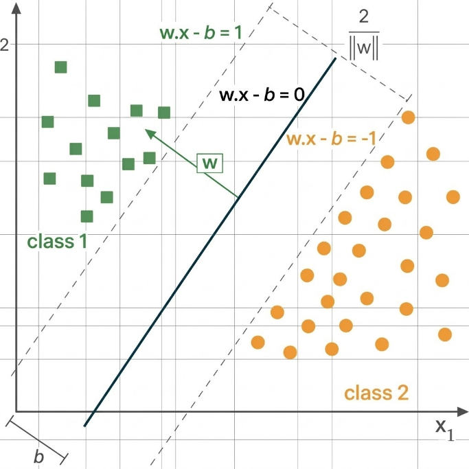
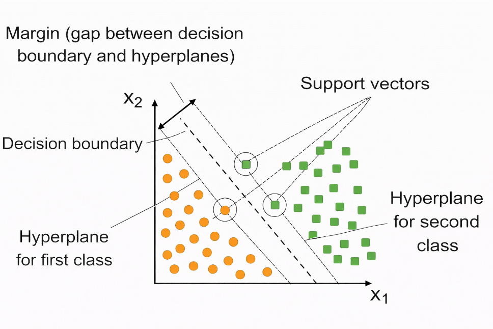
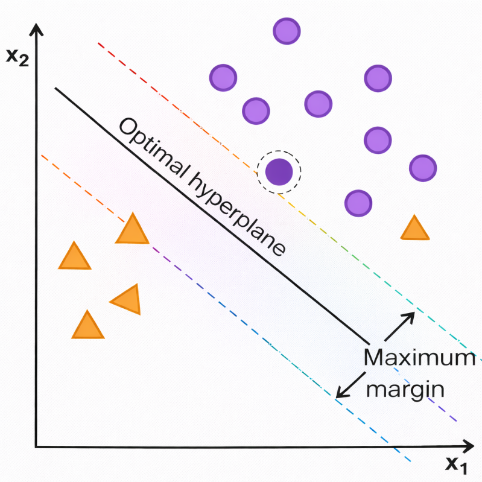
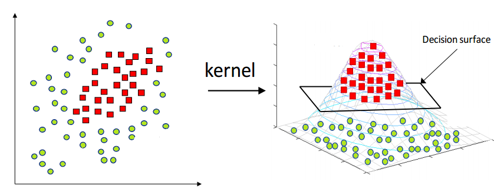
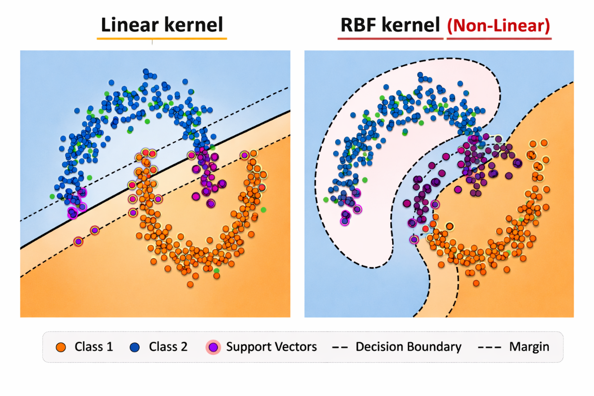

### Introduction

Support Vector Machines (SVMs) are supervised machine learning algorithms used for classification and regression tasks. They were introduced by Cortes and Vapnik (1995) within the framework of Statistical Learning Theory and Structural Risk Minimization (SRM).

The main objective of SVM is to find a decision boundary that separates classes with the maximum possible margin. Instead of minimizing only training error, SVM balances training fit and model complexity to improve generalization on unseen data.

### 1. Hyperplane

A hyperplane divides the feature space into two regions corresponding to different classes. In a 2D feature space, the hyperplane is a line; in 3D, it is a plane; in higher dimensions, it is referred to as a hyperplane.

For a linearly separable dataset, SVM seeks a separating hyperplane:

    
        <i>w</i>T<i>x</i> + <i>b</i> = 0
    

where w is the weight vector (normal to the hyperplane) and b is the bias term.

An optimal hyperplane is the one that maximizes the margin between the classes.

    
    
Figure 1: Linear Support Vector Machine (SVM): Maximum Margin Classifier.

### 2. Support Vectors

Support vectors are the training samples closest to the separating hyperplane. These points determine the position and orientation of the boundary. Points farther from the boundary have little or no direct effect on the final hyperplane.

    
    
Figure 2: SVM Classification with Maximum Margin and Support Vectors.

### 3. Margin Maximization

SVM maximizes the geometric margin by minimizing the norm of the weight vector under classification constraints:

    
        minw,b (1/2)||<i>w</i>||2
    

subject to

    
        <i>y</i>i(<i>w</i> · <i>x</i>i + <i>b</i>) >= 1, for all <i>i</i>
    

This gives a robust classifier with better resistance to noise and improved generalization.

    
    
Figure 3: Optimal Hyperplane and Maximum Margin in Support Vector Machines.

### 4. Kernel Trick

Many real datasets are not linearly separable in the original feature space. The kernel trick addresses this by implicitly mapping data into a higher-dimensional feature space where a linear separator can be found.

Instead of computing explicit transformed coordinates, SVM uses a kernel function to compute inner products directly in transformed space:

    
        <i>K</i>(<i>x</i>i, <i>x</i>j) = <i>&phi;</i>(<i>x</i>i)T<i>&phi;</i>(<i>x</i>j)
    

This enables efficient non-linear classification.

    
    
Figure 4: Kernel Trick: Mapping Data to Higher-Dimensional Space in SVM.

#### Common Kernel Functions

**Linear Kernel** (suitable for approximately linearly separable data):

    
        <i>K</i>(<i>x</i>i, <i>x</i>j) = <i>x</i>i · <i>x</i>j
    

**RBF Kernel** (effective for complex non-linear patterns):

    
        <i>K</i>(<i>x</i>i, <i>x</i>j) = <i>e</i>-||<i>x</i>i - <i>x</i>j||2 / (2<i>&sigma;</i>2)
    

RBF has localized response and can create flexible non-linear boundaries. The variance <i>&sigma;</i>2 controls how far the influence of each training point extends.

    
    
Figure 5: Comparison of Linear and RBF Kernels in SVM.

### 5. L1 Regularization in SVM

Regularization in SVM is controlled by parameter C, which balances margin maximization against training misclassification.

- Higher C: lower tolerance for misclassification, narrower effective margin, risk of overfitting.
- Lower C: more tolerance for misclassification, wider margin, better robustness.

L1 regularization encourages sparse weight vectors by penalizing absolute coefficient magnitude. This can reduce the influence of weak features and improve interpretability in linear SVM formulations.

### 6. Algorithm

**Step 1:** Given training data with labels +1 and -1.

**Step 2:** Define hyperplane:

    
        <i>w</i> · <i>x</i> + <i>b</i> = 0
    

**Step 3:** Define margin constraints:

    
        <i>w</i> · <i>x</i>i + <i>b</i> >= +1, &nbsp; if <i>y</i>i = +1
    

    
        <i>w</i> · <i>x</i>i + <i>b</i> <= -1, &nbsp; if <i>y</i>i = -1
    

    
        <i>y</i>i(<i>w</i> · <i>x</i>i + <i>b</i>) >= 1
    

**Step 4:** Margin width:

    
        Margin = 2 / ||<i>w</i>||
    

**Step 5:** Solve optimization:

    
        min<i>w</i>,<i>b</i> (1/2)||<i>w</i>||2
    

    
        subject to &nbsp; <i>y</i>i(<i>w</i> · <i>x</i>i + <i>b</i>) >= 1, &nbsp; for all <i>i</i>
    

**Step 6:** Use Lagrange multipliers and dual optimization. Support vectors are points with non-zero multipliers <i>&alpha;</i>i.

**Step 7:** For non-linear data, use kernels such as:
- Linear Kernel:

    
        <i>K</i>(<i>x</i>, <i>x</i>') = <i>x</i> · <i>x</i>'
    

- RBF Kernel:

    
        <i>K</i>(<i>x</i>, <i>x</i>') = <i>e</i>-||<i>x</i>-<i>x</i>'||2 / (2<i>&sigma;</i>2)
    

- Polynomial Kernel:

    
        <i>K</i>(<i>x</i>, <i>x</i>') = (<i>x</i> · <i>x</i>' + <i>c</i>)d
    

**Step 8:** Prediction function:

    
        <i>f</i>(<i>x</i>) = &sum;<i>i</i>=1<i>m</i> <i>&alpha;</i>i<i>y</i>i<i>K</i>(<i>x</i>i, <i>x</i>) + <i>b</i>
    

If <i>f</i>(<i>x</i>) >= 0, predict class +1; otherwise class -1.

### 7. Merits of Support Vector Machines

- Good generalization due to margin maximization.
- Effective for both linear and non-linear classification.
- Uses only support vectors to define the boundary, making it robust.

### 8. Demerits of Support Vector Machines

- Computationally expensive for very large datasets.
- Sensitive to kernel and hyper-parameter selection.
- Less interpretable than simpler linear/probabilistic models for non-linear kernels.

