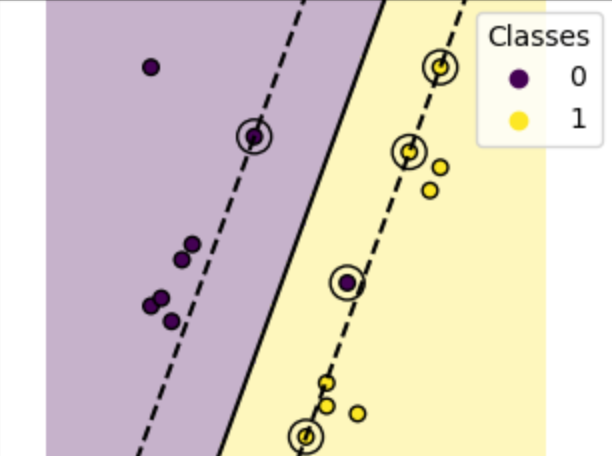
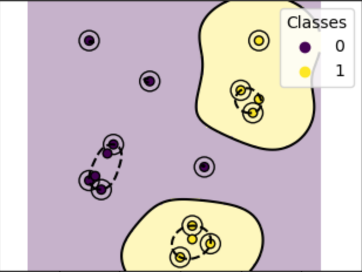

Support Vector Machines (SVMs) were formally established as a statistical learning framework grounded in the principle of Structural Risk Minimization (SRM), by Cortes and Vapnik (1995). The fundamental objective of SVM resides in determining an optimal decision boundary that maximizes the separation margin between different classes in a given feature space.

The goal of the Support Vector Machine is to find the hyperplane that maximizes the margin between two classes. This principle ensures improved generalization performance by minimizing the upper bound on the generalization error rather than merely minimizing empirical risk.

#### 1. Hyperplane

A hyperplane is a flat affine subspace of one dimension less than its ambient space. In an n-dimensional space, a hyperplane has (n-1) dimensions. For a linearly separable dataset, the SVM seeks a separating hyperplane defined by:

wT x + b = 0

where **w** is the weight vector which is normal to the hyperplane and **b** is the bias term.

> **Note:** An optimal hyperplane is the one that maximizes the margin between the classes.

#### 2. Support Vectors

A margin is defined as the perpendicular distance between the hyperplane and the nearest data points from each class. These points are known as **support vectors**.

#### 3. Margin Maximization

The margin maximization problem can be formulated as:

minw,b ½||w||²

with constraint:

yi(w·xi + b) ≥ 1

for all training samples (xi, yi). This formulation ensures that the separating hyperplane lies as far as possible from the closest data points, thereby enhancing the classifier's ability to generalize to unseen data.

#### 4. Kernels

SVM employs the **kernel trick** to handle decision boundaries. The input data is implicitly mapped to a higher-dimensional feature space where separation becomes feasible. This transformation is performed through kernel functions without explicitly computing the coordinates in the high-dimensional space.

**Common Kernel functions include:**

**Linear Kernel:** The linear kernel is suitable when the data is approximately linearly separable.

K(xi, xj) = xi·xj

**Radial Basis Function (RBF) Kernel:** The RBF kernel maps data into an infinite-dimensional feature space and is highly effective for capturing complex, non-linear relationships.

K(xi, xj) = e(-|xi-xj|²/2σ²)

The variance (σ²) controls the influence of individual training samples. Higher values lead to tighter decision boundaries.

The RBF kernel is particularly effective and is commonly used for modelling complex, non-linear relationships due to its radially localised response characteristics.

In the figure given below, Linear Kernel (left) is unable to separate a single 'Class 0' from 'Class 1' sample which RBF Kernel (right) is able to separate well. Mainly due to, RBF can get more meaningful support vectors (circled points) to classify sample points with help of better hyperplane formation.

#### 5. Merits of Support Vector Machines

- **Good generalization performance:** SVMs focus on maximizing the margin between classes, which helps the model perform well on unseen data and reduces overfitting, especially in high-dimensional datasets.
- **Works well for both linear and non-linear data:** By using different kernel functions such as Linear and RBF, SVMs can handle simple linearly separable data as well as complex non-linear patterns effectively.
- **Uses only important data points:** The model depends mainly on support vectors, which are the most critical data points near the decision boundary. This makes the classifier efficient and robust.

#### 6. Demerits of Support Vector Machines

- **High training time for large datasets:** SVM training can be slow and computationally expensive when the dataset is very large, particularly when non-linear kernels are used.
- **Sensitive to parameter selection:** The performance of SVM strongly depends on choosing the right kernel and hyper-parameters. Incorrect values can lead to poor classification results.
- **Harder to interpret results:** Unlike simpler models such as Linear Regression or Decision Trees, especially SVMs with non-linear kernels do not provide clear insights into how individual features might affect predictions.

#### 7. Algorithm

- **Step 1:** Given training data with two classes (+1 and -1)
- **Step 2:** Find hyperplane: `w·x + b = 0`
    - w = weight vector (perpendicular to hyperplane)
    - b = bias term
- **Step 3:** Define margin constraints:
    - For class +1 points: `w·xᵢ + b ≥ +1`
    - For class -1 points: `w·xᵢ + b ≤ -1`
    - Combined: `yᵢ(w·xᵢ + b) ≥ 1`
- **Step 4:** Margin width = `2/||w||`
- **Step 5:** Optimization problem:
    - Minimize: `(1/2)||w||²`
    - Subject to: `yᵢ(w·xᵢ + b) ≥ 1` for all i
- **Step 6:** Solve using Lagrange multipliers:
    - Convert to dual form
    - Find αᵢ values for each training point
    - Support vectors are points where αᵢ > 0
- **Step 7:** For non-linear data, apply **Kernel Trick**:
    - **RBF Kernel:** `K(x,x') = exp(-γ||x-x'||²)`
    - **Polynomial Kernel:** `K(x,x') = (x·x' + c)ᵈ`
    - Maps data to higher dimension where linear separation is possible
- **Step 8:** For prediction:
    - Calculate: `f(x) = Σ(αᵢ × yᵢ × K(xᵢ,x)) + b`
    - If `f(x) ≥ 0` then it belongs to Class +1, otherwise, it belongs to class -1

